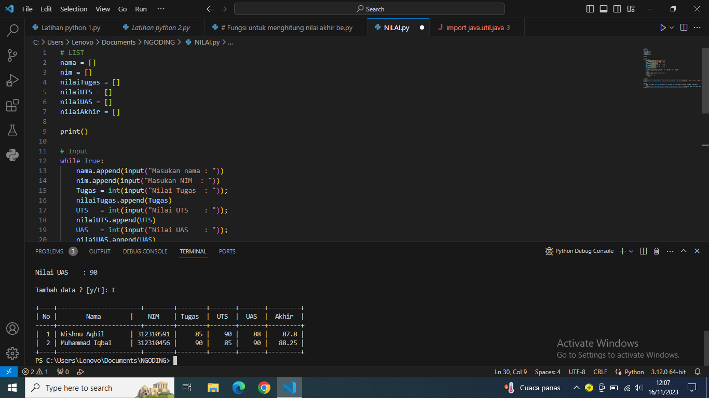
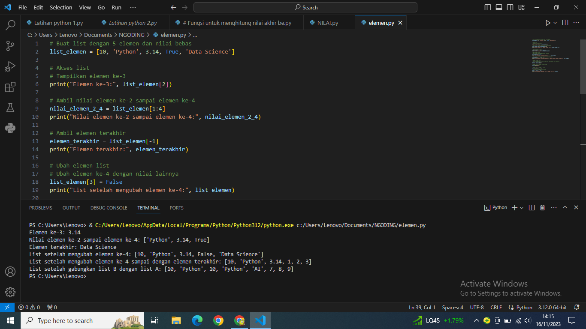

# Pertemuan9
Langkah-langkai NILAI

-Buat sebuah list untuk menyimpan data mahasiswa.

-Inisialisasi variabel untuk bobot nilai (tugas, UTS, UAS).

-Gunakan perulangan untuk terus meminta input data mahasiswa.

-Dalam setiap iterasi, minta input nama dan nilai (tugas, UTS, UAS).

-Hitung nilai akhir berdasarkan bobot yang telah ditentukan.

-Setelah memasukkan data, tanyakan apakah pengguna ingin menambah data lagi.

-Jika jawaban "t" atau "Tidak", keluar dari perulangan.

-Setelah keluar dari perulangan, tampilkan daftar data mahasiswa yang telah dimasukkan.

Langkah-langkah ELEMEN

-tampilkan elemen ke 3

-ambil nilai elemen ke 2 sampai elemen ke 4

-ambil elemen terakhir

-ubah elemen list:

-ubah elemen ke 4 dengan nilai lainnya

-ubah elemen ke 4 sampai dengan elemen terakhir

-tambah elemen list:

-ambil 2 bagian dari list pertama (A) dan jadikan list ke 2 (B)

-tambah list B dengan nilai string

-tambah list B dengan 3 nilai

-gabungkan list B dengan list A

